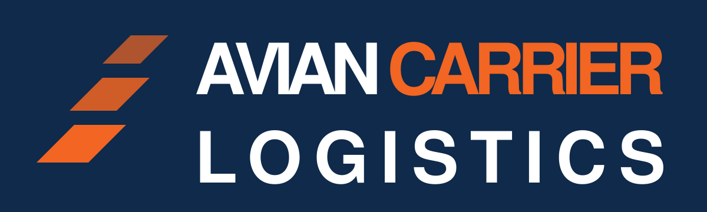

<p align="center">
  
</p>

<p align="center">
  <strong>We deliver your packets. Statistically.</strong><br>
  A Best Effort Industries company.
</p>

---

This repository contains the public site for Avian Carrier Logistics
(aviancarrierlogistics.com, aspirationally), a global freight operation
carrying IP datagrams by bird in full conformance with RFC 1149. Priority
traffic travels under the RFC 2549 quality-of-service extensions, IPv6 is
supported per RFC 6214 for the customer who asks, and every consignment is
trackable end to end, in the sense that both ends have been observed. The
company maintains an industry-defining packet delivery rate of 44.5% and
regards this figure as a commitment, not a ceiling, although it has also
never once been a ceiling.

## The specification is real

The parody is load-bearing on facts. RFC 1149 (IP datagrams on avian
carriers, 1990), RFC 2549 (QoS extensions, 1999), and RFC 6214 (IPv6
adaptation, 2011) are genuine IETF publications and may be consulted. The
numbers on the site come from the real Bergen Linux User Group field
implementation of April 2001: nine packets sent by pigeon, four delivered,
for 55.5% packet loss. The tracking widget honors the resulting 44.5%
delivery rate deterministically per tracking number.

---

## Development notes

The parody ends here. The rest of this file is accurate.

### Layout

A static, zero-build, zero-dependency site. Two HTML files and a handful of
generated images. There is no framework, no bundler and no `package.json`.
Cloudflare Pages serves the repository root exactly as it appears here.

```
index.html            the site, tracking widget included
404.html              catch-all, served automatically by Cloudflare Pages
favicon.svg           icon source of truth (64px grid, the navbar wing mark)
favicon.ico           16/32/48, generated
apple-touch-icon.png  180x180, generated
og.png                1200x630 share image, generated
assets/logo.svg       wordmark, text outlined, used at the top of this README
tools/og.html         source for og.png
tools/logo-src.svg    source for assets/logo.svg, text still live
tools/favicon-16.svg  pixel-grid 16px icon, used for the smallest .ico entry
Makefile              asset regeneration only, never runs at deploy time
_headers              Cloudflare Pages header rules
robots.txt            permissive
wrangler.toml         Cloudflare Pages configuration
```

The page makes zero requests to any external domain. Type is the system
Helvetica/Arial stack, so there are no webfonts to host or wait for.

### The production domain

The site is served at `aviancarrierlogistics.pages.dev`, and that is the host every absolute
URL on the page points at, so link previews resolve. `aviancarrierlogistics.com` remains
the candidate domain and has not been purchased; if the site is
promoted, either to that domain or to a subdomain of the parent
(`avian.besteffortindustries.com`), the canonical host changes in the
places below and nothing else derives it:

| File | What to change |
| --- | --- |
| `index.html` | `rel=canonical`, `og:url`, `og:image`, `twitter:image` |
| `404.html` | nothing, the 404 uses only root-relative paths |
| `tools/og.html` | the domain printed in the footer of the share image |
| `README.md` | this table, and the mentions above it |

After changing `tools/og.html`, re-run `make og`. The Pages project name
(`aviancarrierlogistics` in `wrangler.toml`) follows the domain, so revisit
it too if the domain lands elsewhere.

### Local preview

```sh
make serve          # python3 -m http.server 8000
```

Then open `http://localhost:8000`. A local server is preferable to opening
the file directly because the icon paths are root-absolute. `_headers` is
applied by Cloudflare, not by the local server.

### Regenerating images

Only needed when the tagline, the wordmark or the icon changes. Requires
`google-chrome`, ImageMagick 7 (`magick`) and Inkscape on the machine doing
the regenerating. None of them is needed to deploy, because the outputs are
committed.

```sh
make assets         # everything below
make og             # og.png     <- tools/og.html, via headless Chrome
make favicon        # favicon.ico + apple-touch-icon.png <- the SVG sources
make logo           # assets/logo.svg <- tools/logo-src.svg, text outlined
```

`make logo` outlines the wordmark's text so the README renders the same
everywhere; on Linux the Helvetica/Arial stack resolves through fontconfig
to Liberation Sans, which is metric-compatible. Inkscape rewrites the whole
file, so the `GENERATED` comment at the top has to be pasted back afterwards.

### Deploying

Wrangler is configured via `wrangler.toml`, so a deploy is one command from
an authenticated shell:

```sh
make deploy         # wrangler pages deploy .
```

### Which Cloudflare account this deploys to

This machine has two Cloudflare identities, and picking the wrong one
deploys this site into an unrelated organisation.

**Pages configuration cannot pin the account.** `account_id` is a
Workers-only key; putting it in a Pages `wrangler.toml` makes Wrangler
refuse to run:

```
Configuration file for Pages projects does not support "account_id"
```

So the account is selected by **an auth profile bound to this directory**,
recorded in `~/.config/.wrangler/profiles/directory-bindings.json`:

```sh
wrangler auth activate personal    # already done; re-run after moving the repo
wrangler whoami                    # must print: Active profile: personal
```

Without a binding, Wrangler falls back to the `default` profile, which here
is the other organisation, and it will deploy there without asking. **Check
`whoami` before deploying.** The binding lives outside the repo, so a fresh
clone, a moved directory, or another machine all need
`wrangler auth activate` again.

One extra trap: Wrangler caches the resolved account in the untracked
`.wrangler/cache/` inside this directory. If a deploy ever went to the wrong
account from here, activating the right profile is **not** enough; delete
`.wrangler/` as well, or the cached account ID wins and the API call fails
with `Authentication error [code: 10000]`.

For CI, where profiles do not exist, set `CLOUDFLARE_ACCOUNT_ID` (the
account to deploy into) and `CLOUDFLARE_API_TOKEN` (credentials scoped to
it) as environment variables.

The Pages project is `aviancarrierlogistics`, production branch `main`, with
no build command and the build output directory set to `/`. If you ever
recreate it from the dashboard, use exactly those values; there is nothing
to build, and any build command entered there will only make the deployment
worse.

### Related

The site's footer files it as DOC: BEI-009, a division of
[Best Effort Industries](https://besteffortindustries.com). The division
table in that repository does not list it yet; taking it live there is the
four-step edit documented above that table.

## License

Parody. The company does not exist, and the birds are not employees, which
they have made clear.
